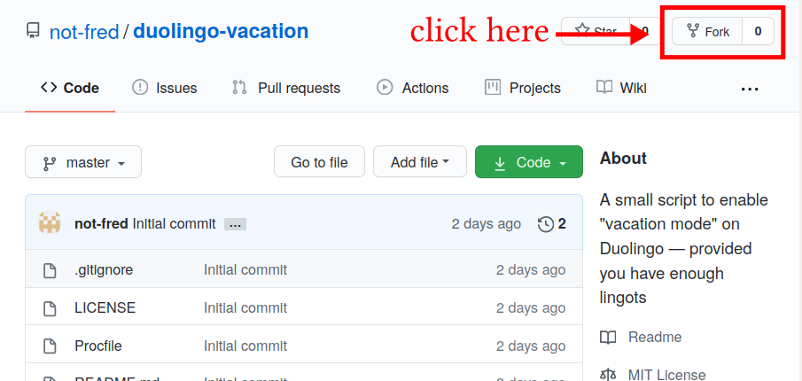

# Duolingo “Vacation Mode”

# Introduction

This is an *unofficial*, *unapproved* Duolingo “vacation mode”, which works by automatically trying to buy a streak freeze everyday. Since each streak freeze costs 10 lingots, the number of days of your vacation has to be less than the total number of lingots you have divided by 10. If a streak freeze has already been bought, no lingots will be subtracted.

I hope the instructions are comprehensive enough for everyone to follow.

## Credits

I claim absolutely no credit for this, as all of my work have already been done for me by [KartikTalwar with his *unofficial* Duolingo Python API](https://github.com/KartikTalwar/Duolingo), with which I merely hobbled together a few trivial lines of code to achieve a passable “vacation mode”.

# Warnings

## Shitty Code

I had to head somewhere without internet access for five days at a time, which would have expired my streak that was in the hundreds. Initially, I was going to ask someone to buy a streak freeze for me every day. This quickly evolved into the idea of making it automatic, which lead to this.

However, as I had very little time before I had to leave for the commitment, my priority was for it to “just work”. Hence the hodge-podge method of setting up a “website” that doesn’t even give a valid response, and the use of third-party schedulers instead of the more structured approach of using [clock processes](https://devcenter.heroku.com/articles/scheduled-jobs-custom-clock-processes). If I ever have the heart to revisit this, I’ll include that functionality.

## Reliability

Because the API is unofficial, the script will fail should Duolingo make drastic changes their endpoint, which might happen without any warning. **In addition, there is no gaurantee whether or not this script violates the terms of service, and if it does, your Duolingo account might be cancelled [[see Section 14](https://www.duolingo.com/terms)]. Do not use this script if that is a risk you are not willing to take**. I don’t think this actually violates any of the terms, but I am not a lawyer so don’t take my word for it.

# Walkthrough

If you have your own server that has Python installed, and know your own way around it, just jump straight to the section [Direct Instructions](#Direct-Instructions). If not, before you proceed with [Heroku Instructions](#Heroku-Instructions), sign up for an account with the following services:

1. https://github.com/
2. https://www.heroku.com/
3. https://www.easycron.com/ **only if you do not wish to add a credit card to Heroku** — Heroku requires a credit card to be added to use the (free) Heroku scheduler. If you prefer not to, EasyCron can be used instead

The account setups should be straightforward enough to not warrant a walkthrough — let me know if one is required.

## Heroku Instructions

1. Sign in to your Github account at https://github.com/login

2. Head to the repository for duolingo-vacation at https://github.com/not-fred/duolingo-vacation and fork it to your own account
   

3. Note down the name of the forked project: it should be of the form `<your github username> / duolingo-vacation`.
   

4. Log in to Heroku at https://id.heroku.com/login

5. Select “Create new app”
   

6. Give it whatever name you like, change the region if you wish (it doesn’t affect anything), then select “Create app”
   

7. Select “Github”, then “Connect to GitHub”. If you can’t find these options, make sure you’re currently within the “Deploy” tab
   

8. Select “Authorize heroku”. You will have to enter your GitHub password again
   

9. You should be redirected back to the page in step 7. In the section under “Connect to GitHub”, search for the name of the repository you noted down in step 3. In most cases, it should be `duolingo-vacation`. Click “Connect”

   

10. If the previous step was successful, the section should appear as shown in the screenshot below. Select “Deploy Branch” under “Manual deploy”. Note: if you wanted to, you could set up automatic deploys instead. However, I give no promises about whether or not my future updates, should there be any, will break things
    

11. A bunch of things should happen, and eventually you should see something like this:
    

12. Head to the “Settings” tab and select “Reveal Config Vars”
    

13. Add the following configuration variables:

    | DUO_USERNAME | \<Your Duolingo username> |
    | ------------ | ------------------------- |
    | DUO_PASSWORD | \<Your Duolingo password> |

    

14. **If you’re not comfortable with adding a credit card to your Heroku account, skip over now to [EasyCron Instructions](#EasyCron-Instructions).** If you are, visit https://www.heroku.com/verify in a new window to add a credit card. Then, come back to the original window, switch to the tab “Resources”, search for the Heroku Scheduler, and select it
    

15. Select “Provision”
    

16. The Heroku Scheduler should now appear in the add-ons. Click on its name to access it
    

17. Select “Create job”, which should cause the Job Editor to pop out. Choose a schedule — we really only need to run the script once a day — and input `python duo.py` as the command. Finally, select “Save Job” 
    

That’s it! You might want [ensure that the script is working](#Ensuring-it-works).

## EasyCron Instructions

1. Note down the URL of your application. This can be found under the tab “Settings”, in the section “Domains”. It is usually of the form `https://<app name>.herokuapp.com`
   
2. Head over to https://www.easycron.com/ and add a Cron Job
   
3. Set the “URL to call” to be the URL you noted down above, and “When to execute” to every day. The other options can be left as they are. Select “Create Cron Job”
   

That’s it! You might want [ensure that the script is working](#Ensuring-it-works).

## Direct Instructions

These instructions are for those who have their own servers that are already preloaded with Python

1. Clone the script from https://github.com/not-fred/duolingo-vacation
2. Use `crontab -e` to add the entry
   `0 12 * * * DUO_USERNAME=<duolingo username> DUO_PASSWORD=<duolingo password> DUO_LOG_FILE=/path/to/log python /path/to/duo.py`
3. Run the script once with `python /path/to/duo.py` just to cover the current day

## Ensuring it works

1. Go back to the [Dashboard](https://dashboard.heroku.com/) and select your application. Then, under “More”, select “View logs”
   
2. If the script was set up properly, there should be some orange lines in the log like in the screenshot
   
